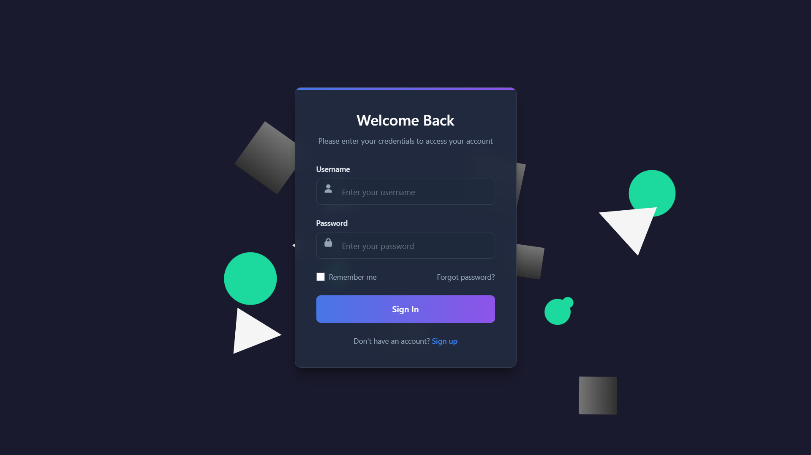
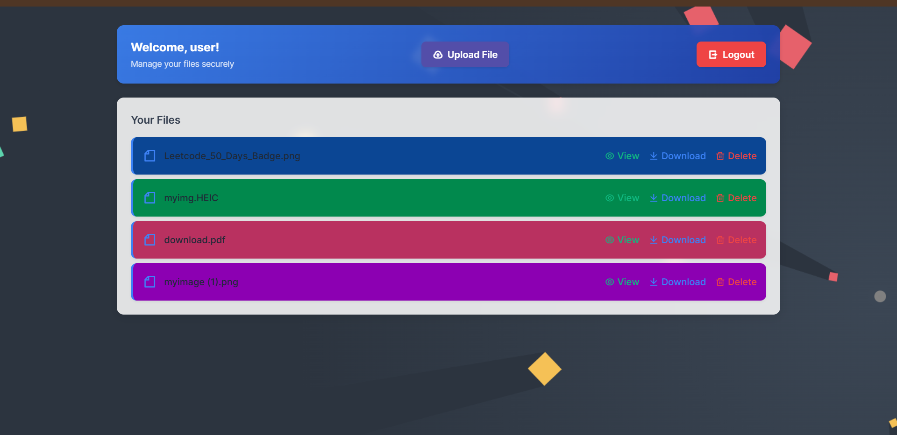
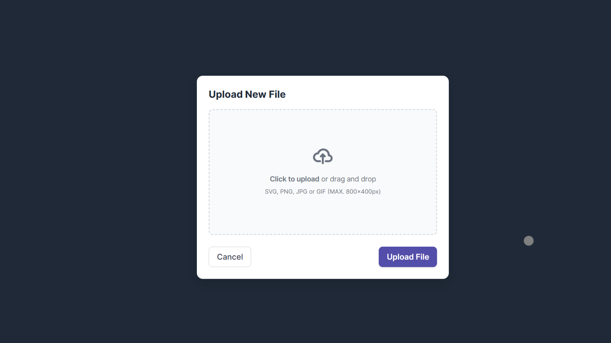

<!-- # npm run start
# authentication implemented by using JWT -json web token and bcrypt
# file upload kiye uske alag folder aur user ke routes alag
# user se related all routes in routes/user.routes (production ka kaaam hai aur ye saare routes app.js me sirf config krne hai)
# npm i express-validator express validator npm to verify that data is coming is valid or not
# bcrypt convert password to hash npm i bcrypt
# npm i jsonwebtoken to check user is logged or not
# token get expired so we use cookies npm i cookie-parser
# home se related all routes in routes/index.routes.js me hai -->
# 🌥️ SkyStore - Cloud File Storage Application

SkyStore is a secure cloud-based file storage application built with **Node.js, Express, MongoDB, and Cloudinary**. It allows users to **upload, manage, and download files** efficiently.

## 🚀 Features

- 🔐 **User Authentication**: Secure signup, login, and logout using JWT.
- 📄 **File Upload**: Upload files to **Cloudinary**.
- 📅 **File Management**: View, download, and delete files.
- 🎨 **Modern UI**: Responsive design using **Tailwind CSS & Flowbite**.
- 🌌 **Interactive Background**: Animated canvas background for an engaging experience.

## 🛠️ Technologies Used

- **Backend**: Node.js, Express.js
- **Database**: MongoDB
- **File Storage**: Cloudinary
- **Frontend**: EJS, Tailwind CSS, Flowbite
- **Authentication**: JWT, bcrypt
- **Session Management**: express-session
- **File Handling**: Multer, Express-fileupload

## 🛆 Installation

```bash
# Clone the repository
git clone https://github.com/yourusername/SkyStore.git
cd SkyStore

# Install dependencies
npm install

# Set up environment variables
cp .env.example .env

# Run the application
npm start
```

Visit: `http://localhost:3000`

## 📂 Project Structure

```plaintext
SkyStore/
├── config/              # Database & Cloudinary setup
├── middleware/          # Authentication middleware
├── models/             # User & File models
├── routes/             # API routes
├── views/              # EJS templates
├── public/             # Static assets (CSS, JS, images)
├── app.js              # Main application file
├── .env                # Environment variables
├── package.json        # Project dependencies
└── README.md           # Documentation
```

## 📚 Usage

### 🔑 Authentication
1. **Signup**: Enter details and create an account.
2. **Login**: Enter credentials to access your files.
3. **Logout**: Securely log out anytime.

### 📂 File Management
1. **Upload**: Select a file and upload it.
2. **Download**: Click the download button to get a file.
3. **Delete**: Remove unwanted files with a single click.

## 📸 Screenshots

### Signup Page


### Login Page


### Home Page


### File Upload Popup


## 🤝 Contributing

1. Fork the repo.
2. Create a new branch: `git checkout -b feature/YourFeature`.
3. Commit changes: `git commit -m 'Add new feature'`.
4. Push and create a pull request.

## 💜 License

This project is licensed under the **MIT License**.

## 📩 Contact

For questions or feedback, contact **[Your Name](mailto:your.email@example.com)**.

---

Thanks for using **SkyStore**! 🚀️☁️


